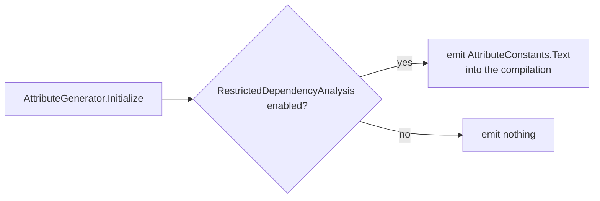
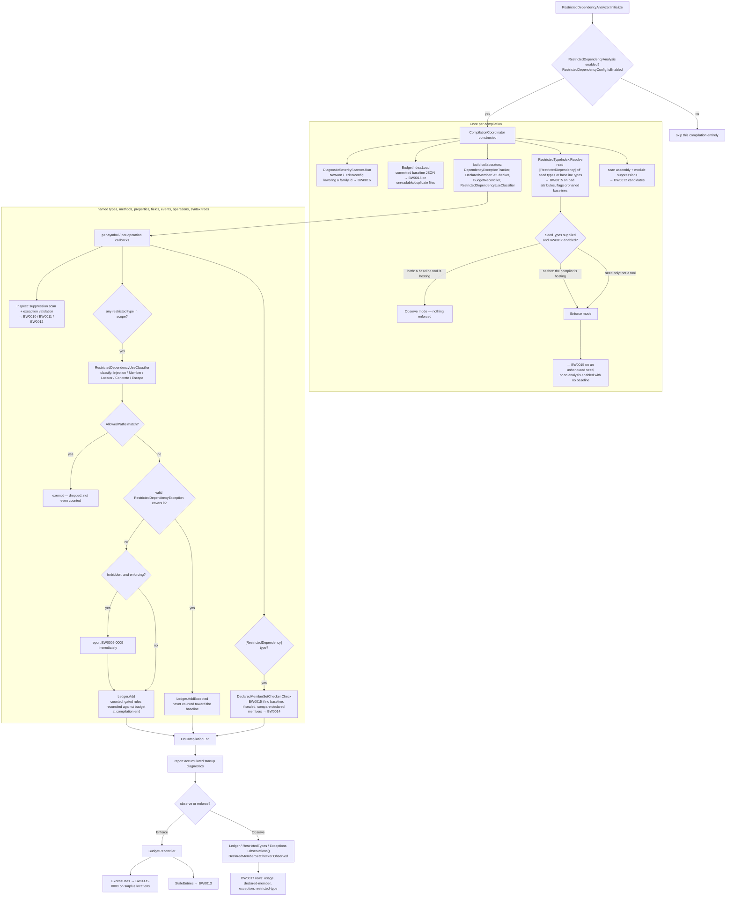
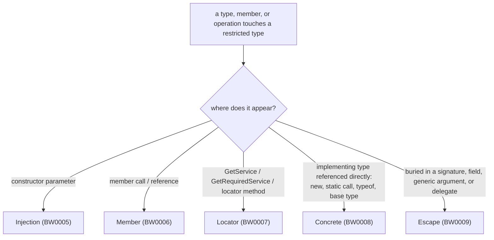

# Bitwarden.Server.Sdk.RestrictedDependencies.Analyzers

Roslyn analyzer and incremental source generator for the Bitwarden Restricted Dependencies feature.

## Contents

- **`RestrictedDependencyAnalyzer`** - Diagnostic analyzer that enforces restricted use of dependencies deemed ready for deprecation.
- **`AttributeGenerator`** - Incremental source generator emitting `[RestrictedDependency]` and `[RestrictedDependencyException]` into every analyzed compilation.

## Architecture

The generator and the analyzer are two independent Roslyn passes; the generator's output becomes part of what the analyzer sees.



`RestrictedDependencyAnalyzer` builds one `CompilationCoordinator` per compilation. It resolves the committed baselines and restricted types once, classifies every restricted-type use it sees during the compilation, and either reconciles against the baseline or reports observations at the end, depending on whether the compiler or a baseline tool is hosting it:



`RestrictedDependencyUseClassifier` picks one of five usage kinds for a given use, each mapping to one BW0005-0009 diagnostic:



## Diagnostics

BW0005-BW0017. See [docs/diagnostics.md](https://github.com/bitwarden/dotnet-extensions/blob/main/docs/diagnostics.md).

## Running tests

```bash
dotnet run --project tests/Bitwarden.Server.Sdk.RestrictedDependencies.Analyzers.Tests
dotnet run --project tests/Bitwarden.Server.Sdk.RestrictedDependencies.Tests
```
